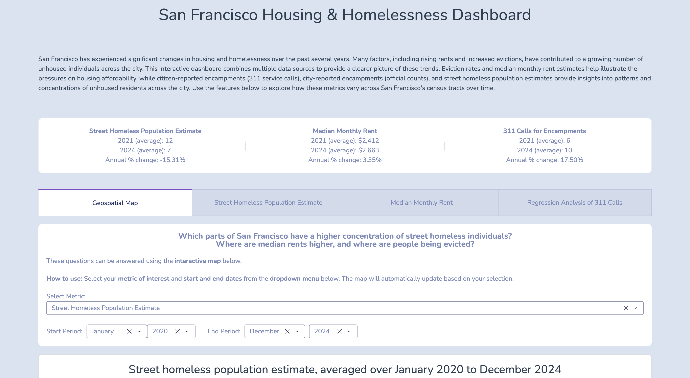
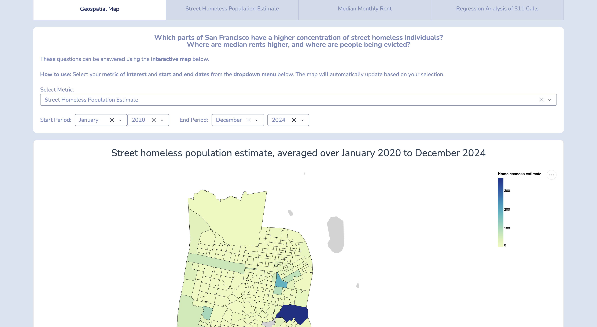
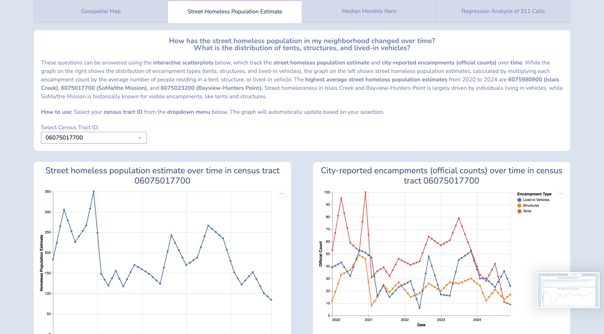
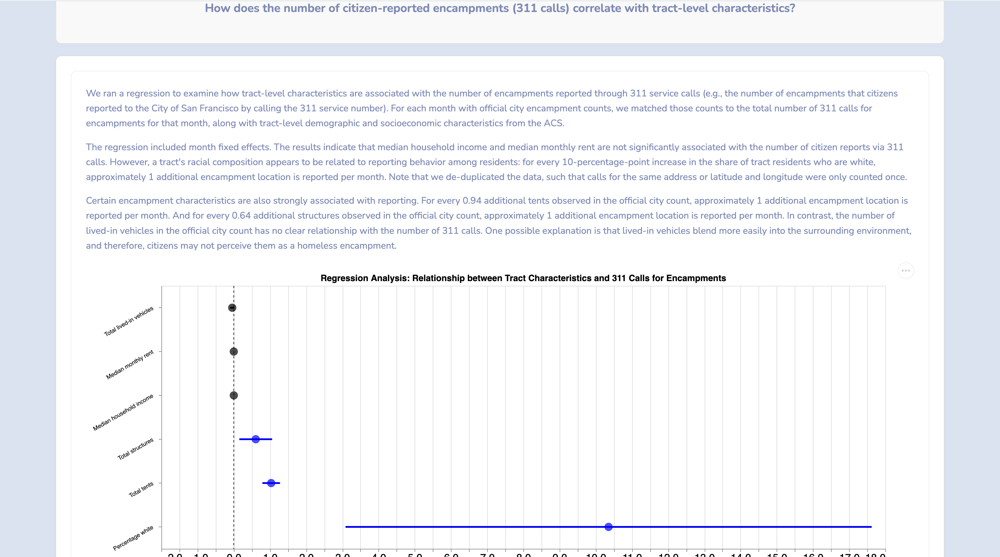

# Project: All Access Livable Housing

## Members
- Haeji Ahn <ahaeji925@uchicago.edu>
- Lily Hoffman <lshoffman@uchicago.edu>
- Amy Lin <amsylin@uchicago.edu>
- Amanda Song <amandasong@uchicago.edu>

## Abstract
Several cities in the United States are experiencing a homelessness crisis, with San Francisco often cited due to its high housing prices and limited housing supply. Our project examines tract-level homelessness and housing indicators in San Francisco from 2020 to 2024. We aligned multiple datasets onto the same spatial-temporal scale, aggregating and interpolating point-level data (quarterly encampment counts, daily 311 calls, and daily eviction reports) to census tracts by month. We also disaggregated monthly ZIP code-level median rent data to census tracts by weighting with HUD crosswalks and normalizing with ACS baseline values.

Using multipliers from the literature applied to encampment counts, we generated tract-level estimates of the street homeless population. These estimates and metrics were integrated into an interactive dashboard featuring: (1) a heatmap showing metrics by tract and month; (2) scatterplots of street homelessness and the distribution of tents, structures, and vehicles for a selected census tract; (3) a scatterplot of monthly median rent that updates by ZIP code; and (4) a regression analysis linking 311 calls to tract-level characteristics.

Overall, our dashboard highlights spatial and temporal patterns in homelessness and housing, helping policymakers and community organizations better target interventions, allocate resources, and make informed housing policy decisions.

## Screenshots of project
Dashboard Mainpage

Dashboard Tab 1: Map

Dashboard Tab 2: Linechart - Homelessness

Dashboard Tab 3: Linechart - Rent

Dashboard Tab 4: Regression

## Instructions to run our project 
1. Clone our repository by running `git clone git@github.com:uchicago-2026-capp30122/project-all-access-livable-housing.git` in your terminal.
2. After cloning the repository, run `uv sync` in the project root directory to install the required packages and set up the virtual environment.
3. *[Optional -- these files should already be included in the repository]* To retrieve API data and regenerate the clean data files, run `uv run python -m src --data` in the root directory. This will take around 3 minutes to run.
4. To launch our interactive dashboard and visualizations, run `uv run python -m src --dashboard` in the root directory.
5. Copy the Dash URL printed in the terminal and paste it into your web browser to view the dashboard.

## Citations for data sources

### Data Source #1: DataSF Open Data Portal
#### Data Source #1.1: 311 Cases
- https://data.sfgov.org/City-Infrastructure/311-Cases/vw6y-z8j6/about_data

#### Data Source #1.2: Quarterly count of tents, structures, and lived-in vehicles
- https://app.powerbigov.us/view?r=eyJrIjoiY2FmZDNiY2ItMjA2OS00YjU5LWFkMDUtODlkNTgyZmQ3MmNhIiwidCI6IjIyZDVjMmNmLWNlM2UtNDQzZC05YTdmLWRmY2MwMjMxZjczZiJ9
- Put in an offline email request and obtained a spreadsheet of historical tent counts from April 2019 to December 2025 that serves as the underlying dataset for the map 

#### Data Source #1.3: Evictions data
- https://data.sfgov.org/Housing-and-Buildings/Eviction-Notices/5cei-gny5/about_data

### Data Source #2: Census Data
#### Data Source #2.1: ACS data on rental costs and demographic data
- https://data2.nhgis.org/main (2020-24 ACS 5-year data for population, median rent, median household income, racial composition, and number of renter households by tract)

#### Data Source #2.2: Listing and geographic boundaries of census tracts in SF
- https://data.sfgov.org/Geographic-Locations-and-Boundaries/Census-2020-Tracts-for-San-Francisco/tmph-tgz9/about_data (to obtain SF census tract IDs)
- https://www.census.gov/cgi-bin/geo/shapefiles/index.php (California census tracts shapefiles)

### Data Source #3: Zillow Observed Renter Index (ZORI)
- https://www.zillow.com/research/data/ (ZORI Smoothed: All Homes Plus Multifamily Time Series)

### Data Source #4: HUD ZIP Code Crosswalks
- https://www.huduser.gov/portal/datasets/usps_crosswalk.html (ZIP-TRACT crosswalks)

### Data Source #5: Sacramento 2024 PIT Count Report
- https://www.sacramentostepsforward.org/wp-content/uploads/2025/08/PIT-Report-2024-06-04-Final-with-Cover.pdf (to obtain multipliers for street homeless population estimates)

## Project video
https://drive.google.com/file/d/1T6SVS_VbMjVPbhwko3zUDULbmq6zvg9c/view?usp=sharing

## Acknowledgments
Many thanks to our CAPP122 instructor, James Turk, and our assigned TA, Andrés Camacho, for their support and guidance.
