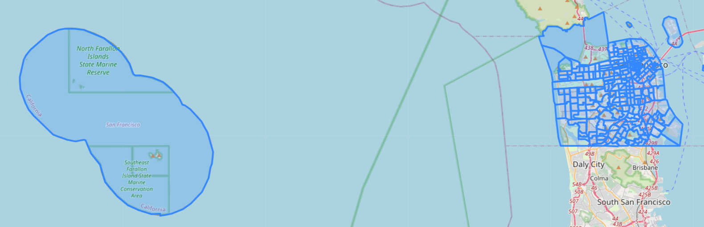
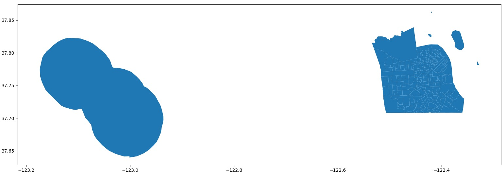
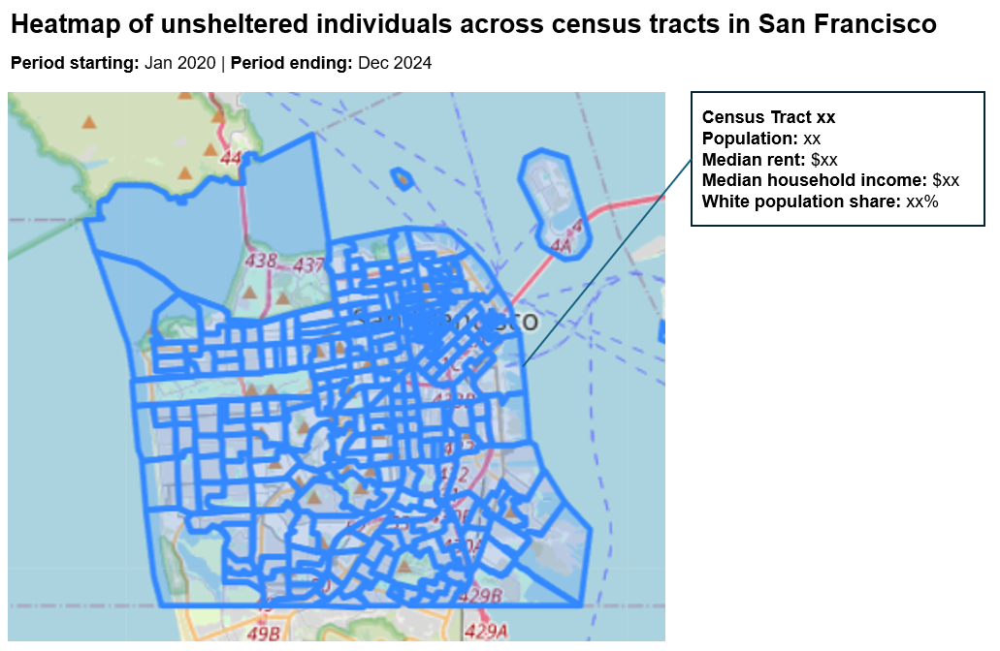
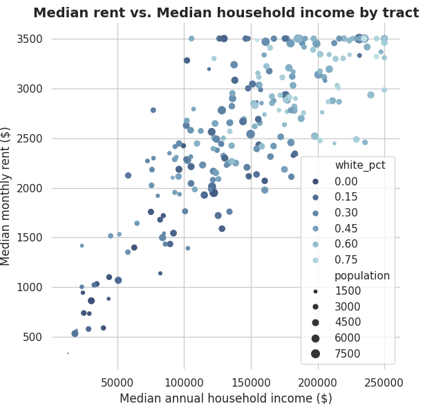

# All Access Livable Housing

## A repository with an appropriate project layout.
- Updated repository to have a src directory which contains all our source codes, where each file serves a different function (e.g., get_data.py to extract data, process_data.py to clean and merge data, etc.)
- Note: Code in process_zori.py will be moved to process_data.py once the code is cleaned
- Other directories include raw-data and clean-data, which differentiate our raw data files from our processed data files

## Working data import code for at least one of your sources.
- Downloaded files for 311 cases (csv), ZORI (csv), encampment (csv), census and ACS data (csv, shapefiles)
- Wrote code to access evictions API
- Wrote code to scrape shelter waitlist (archived due to lack of data availability for the full period of analysis)
- Refer to get_data.py for code
- Wrote code to standardize and clean the 311 cases and encampments and subsequently match files

## An initial draft of data reconciliation/cleaning process.
- Cleaned data for 311 cases, ZORI, encampments, census and ACS; imputed missing/odd data for ZORI and census (refer to process_data.py for code)
- Started reconciling data by joining ACS data to the respective census tracts in the shapefiles (refer to process_data.py for code) and wrote code to match point data to census tracts via quadtrees (refer to quadtree.py for code)
- We began matching 311 cases to specific encampments by neighborhood, month, and year. The goal is to understand how 311 reports typically cluster around an encampment and then use unmatched 311 reports to improve our estimates of homelessness.

## An initial draft of the final visualization/simulation/etc. that may be using mock data at this point.
- Currently created initial plots of SF tracts

- End goal is to have two different visualizations - (1) heatmap of SF tracts based on homelessness rates, hopefully interactive with homelessness rates displayed based on the time period selected, and with census tract statistics displayed if the user clicks on a specific census tract (e.g., population, median rent, etc.); (2) scatter plot of key statistics (e.g., percentile of homelessness against percentile of eviction rates across the full period of analysis 2020-24)

## The beginning of a README.
- Started creating a README and input some required components

## Attend a meeting with course staff to discuss the state of the project
- Met Andres on Feb 18 (Wed) to discuss the current state of our project and how we plan to move forward in the remaining weeks